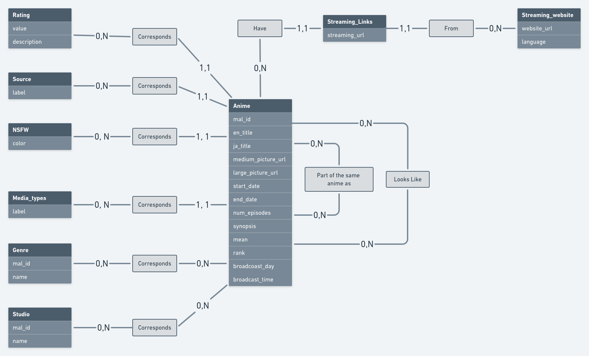

# 🇫🇷 🇯🇵 otaku-API &nbsp;&nbsp;&nbsp;&nbsp;&nbsp;&nbsp;&nbsp;

o'taku is an API that allows you to find functional streaming links for your favorite anime. This project aims to simplify the tracking of a particular anime. Indeed, when you search for an anime, you will receive a lot of information about it (all the information comes from a database provided and updated every day which is fed by the MyAnimeList API, I made this choice to decrease the response time) but also, a list of streaming links available in several languages. No more evenings looking for a working streaming link before binge-watching your favourite series!

-   This project is currently **under development.** 🏗️

## Development stages 🚀

#### 1 - Reflecting on the application's data model

    <figcaption align="center">After connecting to the MyAnimeList API, I analysed the data it provided me with in order to think about a viable conceptual data model to store this data efficiently in a PostgreSQL database</figcaption>
    

#### 2 - Create a script to get a streaming link corresponding to the desired anime

#### 3 - Rethink the structure of the database to make it scalable

    <figcaption align="center">I mean that streaming links and metadata from MAL will be retrieved only when needed, and then inserted into the database, which will reduce future response time for the same requests</figcaption>
    <!--  -->

#### 4 - Retrieve metadata of the streamed anime via My Anime List

#### 5 - Create a web application with React, in order to use this API in a simple and playful way