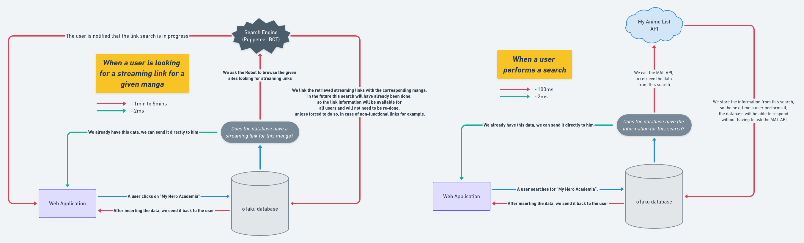
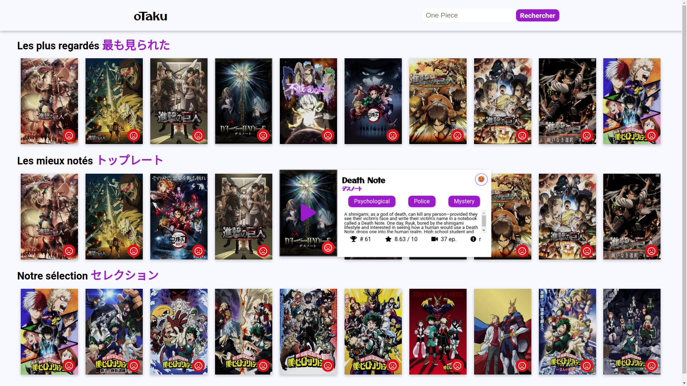

# 🇯🇵 oTaku | Anime Search Engine &nbsp;&nbsp;&nbsp;&nbsp;&nbsp;&nbsp;&nbsp;

o'taku is an API that allows you to find functional streaming links for your favorite anime. This project aims to simplify the tracking of a particular anime. Indeed, when you search for an anime, you will receive a lot of information about it (all the information comes from a database provided and updated every day which is fed by the MyAnimeList API, I made this choice to decrease the response time) but also, a list of streaming links available in several languages. No more evenings looking for a working streaming link before binge-watching your favourite series!

-   This project is currently **under development.** 🏗️
-   React application on the frontend. I'm not a designer BUT I did apply myself! After nothing better than looking at your favorite manga on an eye-pleasing platform 🐻
-   Currently, only VF 🇫🇷 and VOSTFR 🇯🇵 are supported and available. Using it for strictly personal use, I prefer to focus on adding features to improve my skills while having fun

## Development stages 🚀

#### 1 - Reflecting on the application's data model

    <figcaption align="center">After connecting to the MyAnimeList API, I analysed the data it provided me with in order to think about a viable conceptual data model to store this data efficiently in a PostgreSQL database</figcaption>
    

#### 2 - Create a script to get a streaming link for the desired anime and its metadata via My Anime List.

    <figcaption align="center">This part has been one of the most difficult at this stage of the application. The MAX query count of the MyAnimeList API was limited, so it was impossible for me to retrieve all the data from the API to serve my own application with a lower response time since the database would be present locally and indexed correctly. Moreover, the time to search for links is very variable according to the quantity of data found and the number of episodes of the ANIME, it was also impossible to retrieve links for more than 30k manga, while only 5% of them will be useful, moreover the seeding of the database would last days.
So I thought about another way to think about things in order to go and get the useful information only when it is necessary. All this is explained in the diagram below.</figcaption>
    

#### 3 - Rethink the structure of the database to make it scalable

    <figcaption align="center">Following the change of management, the structure of the database had to be slightly rethought, in order to enter data only when they have never been searched before, and to serve the already existing data in a lesser response time.</figcaption>
    <!--  -->

#### 5 - Create a web application with React, in order to use this API in a simple and playful way

    <figcaption align="center">I mean that streaming links and metadata from MAL will be retrieved only when needed, and then inserted into the database, which will reduce future response time for the same requests</figcaption>
    

